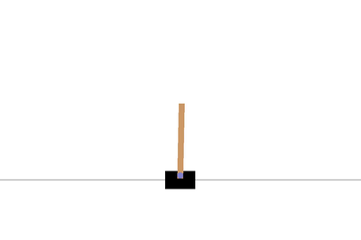
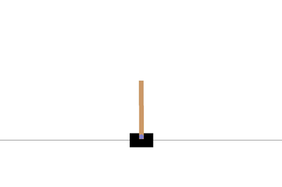
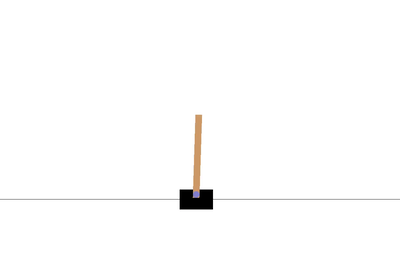
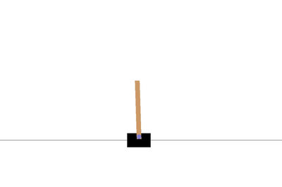

# Asynchronous Advantage Actor Critic (A3C)

~ 1.5 hrs of training on 16" Macbook Pro with 8 processes.

Each of the following GIFs are from the same model, which got to an average reward of about 100 before I cut it off.

